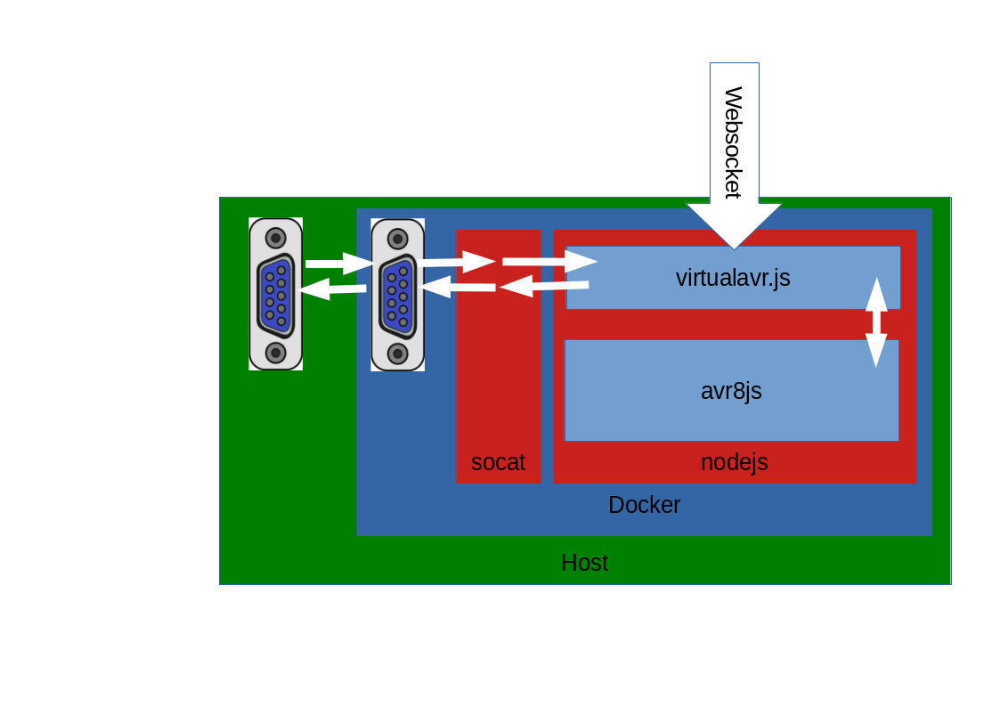

[](https://github.com/pfichtner/virtualavr/actions/workflows/docker-publish.yml)
[](https://github.com/pfichtner/virtualavr/actions/workflows/docker-image.yml)
[](https://hub.docker.com/r/pfichtner/virtualavr/)
[](https://hub.docker.com/r/pfichtner/virtualavr/)
[](https://hub.docker.com/r/pfichtner/virtualavr/)

### virtualavr

An AVR/Arduino Simulator based on [avr8js](https://github.com/wokwi/avr8js) to enable automated tests.
- You want to test your microcontroller program on an integration level without flashing a real microprocessor every time? 
- You want to test some code that interacts with a microprocessor but you want to test without having real hardware connected and flashed (e.g. on a ci server)?

This is where virtualavr comes into play

virtualavr comes as a Docker image that provides a virtual AVR including a virtual serial device which you can connect to just like to real hardware. 


Start the container (will load the included blink sketch)
```docker run -v /dev:/dev -d pfichtner/virtualavr```

Connect to virtual serial device
```minicom -D /dev/virtualavr0```

Full example, you can pass the devicename as well the code that gets compiled and the executed on the virtual AVR
```docker run -p8080:8080 -e VIRTUALDEVICE=/dev/ttyUSB0 -e FILENAME=myArduinoSketch.ino -v /dev:/dev -v /path/of/the/sketch:/sketch -d pfichtner/virtualavr```

Environment variables supported
- VIRTUALDEVICE the full path of the virtual device that socat creates (defaults to /dev/virtualavr0)
- DEVICEUSER user the VIRTUALDEVICE belongs to (default root)
- DEVICEGROUP group the VIRTUALDEVICE belongs to (default dialout)
- DEVICEMODE file mode of the VIRTUALDEVICE (default 660)
- OVERWRITE_VIRTUALDEVICE set to something not empty if and already existing device (e.g. /dev/ttyUSB0) should be overwritten/replaced). If the device gets overwritten it does not get restored by the container! So this should be used if you created the device/file for the purpose of providing it for the use with a virtualavr instance)
- FILENAME the name of the ino/hex/zip file (defaults to sketch.ino). Zipfile content is wokwi structure (sketch.ino, libraries.txt). If the filename ends with '.hex' it gets passed to virtualavr directly
- BAUDRATE baudrate to use (defaults to 9600). Hint: If haven't seen problems when baudrate differs from the really used one
- VERBOSITY verbosity args for socat e.g. "-d -d -v" see man socat for more infos. That way you can see what is "copied" by socat from serial line to avr8js/node and vice versa
- PAUSE_ON_START virtualavr will start in pause mode. See commands for pausing/unpausing
- PUBLISH_MILLIS analog values gets published each millis on change (default 250)
- MIN_DIFF_TO_PUBLISH only publish analog values if they differ more than this value (default 0)
- BUILD_FQBN Fully Qualified Board Name to use for compile (default "arduino:avr:uno")
- BUILD_EXTRA_FLAGS to set/overwrite defines, e.g. '-DSLEEP_MILLIS=100 -DMESSAGE_TEXT="Hello World"'
- SERIAL_TCP — Connect via TCP instead of PTY (requires a socat TCP→PTY bridge running on the host), see [SERIAL_TCP](#serial_tcp---tcp-serial-mode)

# Screencast of usage
The screencast is not uptodate!!!
- The prefered way of setting pin states is no more "fakePinState" but "pinState"
- You now have to enable the reporting of pin states by sending a websocket message ```{ "type": "pinMode", "pin": "13", "mode": "digital" }```
<a href="http://pfichtner.github.io/assets/virtualavr-asciinema/"></a>

# Websocket messages
## Sent by virtualavr
- Changes when listening for digital pin state changes ```{ 'type': 'pinState', 'pin': '13', 'state': true }```
- Changes when listening for analog pin state changes ```{ 'type': 'pinState', 'pin': 'A0', 'state': 42 }```
- When data is received via serial line and serial debug is enabled ```{ 'type': 'serialDebug', 'direction': 'RX', 'bytes': (bytes received) }```
- When data is send via serial line and serial debug is enabled ```{ 'type': 'serialDebug', 'direction': 'TX', 'bytes': (bytes send) }```
- All messages have a "cpuTime" attribute that contains the seconds (floating point number) the microcontroller cpu is running. 
- Messages to virtualavr which include a "replyId" are replied by virtualavr after they have been processed. The reply message  is the original message send to virtualavr complemented by an "executed" attribute that is "true". So clients know when their async message has been processed, e.g. when a pin state/value was changed actually. 

## Accepted by virtualavr
- Set the mode for which pin what messages should be send: ```{ "type": "pinMode", "pin": "12", "mode": "analog" }``` (supported modes: analog (or alternative pwm), digital, any other value means off)
- Set a pin to the passed state/value ```{ "type": "pinState", "pin": "12", "state": true }```
- Set a (PWM) pin to the passed state/value ```{ "type": "pinState", "pin": "12", "state": 42 }```
- Pause or unpause virtualavr ```{ "type": "control", "action": "pause|unpause" }```
- Enable/disable serial debug ```{ "type": "serialDebug", "state": true|false }```
- Any message that has an "replyId" gets replied by virtualavr (see [Sent by virtualavr](#sent-by-virtualavr))

## SERIAL_TCP — TCP Serial Mode
```SERIAL_TCP``` is mostly intended for Docker Desktop / WSL2 setups, where Docker runs inside a VM and the host PTY cannot be made available via a bind mount (```-v /dev:/dev```). It can be used on Linux as well, but in that case it is usually unnecessary. 
```SERIAL_TCP``` makes virtualavr connect to a TCP endpoint instead of creating a PTY inside the container.

You must run socat on the host to bridge TCP to a PTY:
```
socat -d -d pty,raw,echo=0 tcp-listen:55555,reuseaddr,fork
```
This creates a PTY (e.g. /dev/pts/4) and forwards all TCP traffic on port 55555 to it.
Starting the container (no /dev mount is needed):
```
docker run -e SERIAL_TCP=host.docker.internal:55555 -e FILENAME=myArduinoSketch.ino -v /dev:/dev -v /path/of/the/sketch:/sketch -d pfichtner/virtualavr
```
Notes
- Use ```host.docker.internal``` on Docker Desktop (macOS/Windows); on Linux, use the host machine's IP address accessible from the container.
- The container never touches the PTY in TCP mode — it talks only via TCP
- Host socat must be started before the container starts

# Testing your sketch within your prefered programming language
Because virtualavr offers a websocket server to interact with you can write your tests with any language that supports websocket communication (there shouldn't be many language without). 
So here's an example of a Java (JUnit5) Test using a dedicated testcontainers module for virtualavr is available on Maven Central.

[](https://search.maven.org/artifact/io.github.pfichtner/testcontainers-virtualavr)

This allows you to write Java integration tests that automatically start a virtual AVR simulator inside a Testcontainers-managed Docker container.
The library provides:
- a VirtualAvrContainer Testcontainers module
- a typed VirtualAvrConnection API for interacting with the simulator
- convenience helpers for pin states, reporting modes, and timing

```
<dependency>
    <groupId>io.github.pfichtner</groupId>
    <artifactId>testcontainers-virtualavr</artifactId>
    <version>0.0.2</version>
</dependency>
```

```java
private static final String INTERNAL_LED = "13";

@Container
VirtualAvrContainer<?> virtualavr = new VirtualAvrContainer<>() //
					.withSketchFile(new File("blink.ino"));

@Test
void awaitHasBlinkedAtLeastThreeTimes() {
  VirtualAvrConnection virtualAvr = virtualavr.avr();
  virtualAvr.pinReportMode(INTERNAL_LED, DIGITAL);
  await().until(() -> count(virtualAvr.pinStates(), PinState.on(INTERNAL_LED)) >= 3
		  && count(virtualAvr.pinStates(), PinState.off(INTERNAL_LED)) >= 3);
}
```

```python
@pytest.fixture
def docker_container():
    client = docker.from_env()
    container = client.containers.run(
        "pfichtner/virtualavr",
        detach=True,
        auto_remove=True,
        ports={"8080/tcp": None},  # Map container's websocket port to a random free port on the host
        volumes={
            os.path.abspath(os.path.join(os.getcwd(), "ArdulinkProtocol")): {"bind": "/sketch", "mode": "ro"},
            "/dev/": {"bind": "/dev/", "mode": "rw"}
        },
        environment={
            "VIRTUALDEVICE": SERIAL_PORT,
            "FILENAME": "ArdulinkProtocol.ino",
            "DEVICEUSER": str(os.getuid())
        }
    )

    ws_url = f"ws://localhost:{container.attrs['NetworkSettings']['Ports']['8080/tcp'][0]['HostPort']}"
    yield container, ws_url
    container.remove(force=True)

def test_can_switch_digital_pin_on_and_off(docker_container):
    container, ws_url = docker_container
    ws = websocket.create_connection(ws_url, timeout=WS_TIMEOUT)
    send_ws_message(ws, {"type": "pinMode", "pin": "12", "mode": "digital"})

    with serial.Serial(SERIAL_PORT, SERIAL_BAUDRATE, timeout=SERIAL_TIMEOUT) as ser:
        send_serial_message(ser, "alp://ppsw/12/1")
        wait_for_ws_message(ws, {"type": "pinState", "pin": "12", "state": True})

    ws.close()
```
For a complete python example see https://github.com/pfichtner/virtualavr/tree/main/demo/python


```Cucumber
Scenario: Noise level is within 90% of the reference, green led is on
  Given the pin 10 is monitored
  And the pin 11 is monitored
  And the pin 12 is monitored
  When pin A0 is set to 1000
  And pin A1 is set to 900
  Then pin 10 should be on
  And pin 11 should be off
  And pin 12 should be off
```
For a complete python gherkin example see https://github.com/pfichtner/virtualavr/tree/main/demo/python-gherkin

# What's inside? How does it work? 
- The heart is [avr8js](https://github.com/wokwi/avr8js)
- virtualavr.js runs inside a node process, and links nodejs' ~stdin/stdout~ filedescriptor (fd) 3/4 to avr8js' virtual serial port
- [socat](http://www.dest-unreach.org/socat/) creates a virtual serial port on the local machine (better said inside the docker container) and links this virtual serial port (RX/TX) to nodejs' ~stdin/stdout~ filedescriptor (fd) 3/4. That way you get a virtual serial port which is connected to the serial port of the simulator (avr8js)
- Due to the whole thing is packaged inside a docker container the serial port is inside that docker container, too (and only). So you have to do volume mounts (-v /dev:/dev) so that you get access to the "in-docker-device" on your local computer 
- Virtualavr starts a websocket server you can connect to. Using that websocket connection you can control the states of the analog/digital pins as well cou get informed about things hapening on the virtual AVR e.g. state changes of the pins 




# Todos
- Provide Java Bindings as maven artifacts
- Add an example (jest?): How to test firmware, e.g. firmware reading DHT22 values and writing infos/warnings to console/SSD1306
- We could use WS also to load firmware
- Possibility to define component layout, e.g. add a DHT22
- JS Callbacks for pin states/Components, e.g. DHT22
- Java-Bindings for pin states/Components, e.g. DHT22 (IPC, using websockets?)
- Watch support: Recompile/reload firmware when changed on filesystem
- Could we implement upload? So that you can upload the compiled firmware to running container / /dev/virtualdevice?
  Could we use arduino firmware? https://github.com/arduino/ArduinoCore-avr/tree/master/bootloaders/atmega : If this works? Do we have to upload elf binaries?

# License

This project is dual-licensed:

- **Apache License 2.0** — for open-source use and compatibility with Apache projects.
- **Commercial License** — for proprietary/commercial use not permitted by the Apache License.

You are free to use, modify, and distribute this software—including for commercial purposes—under the terms of the Apache License 2.0. If you want to do something beyond what the license allows, you must obtain a separate license from the copyright holder. Please contact us at virtualavr@public-files.de

